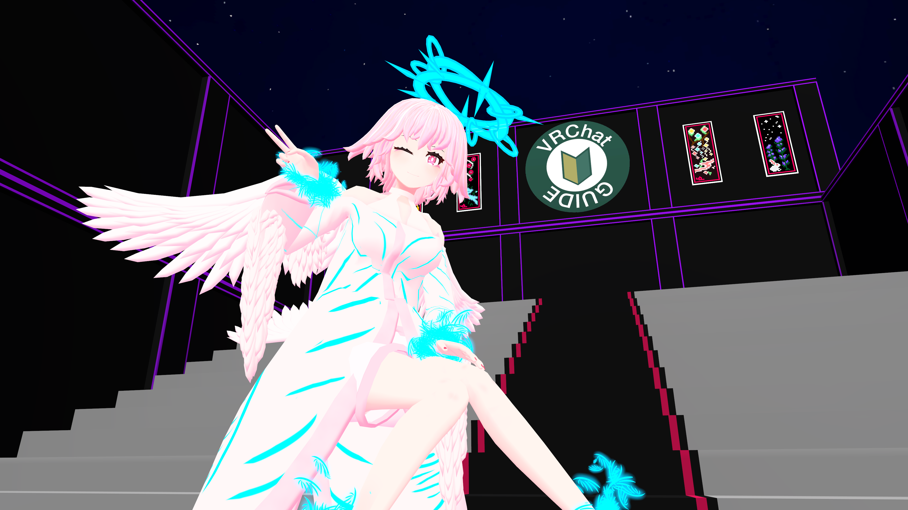
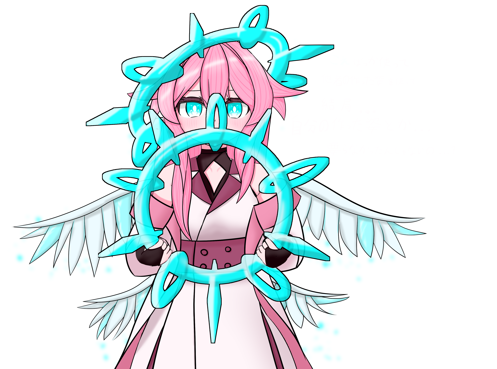
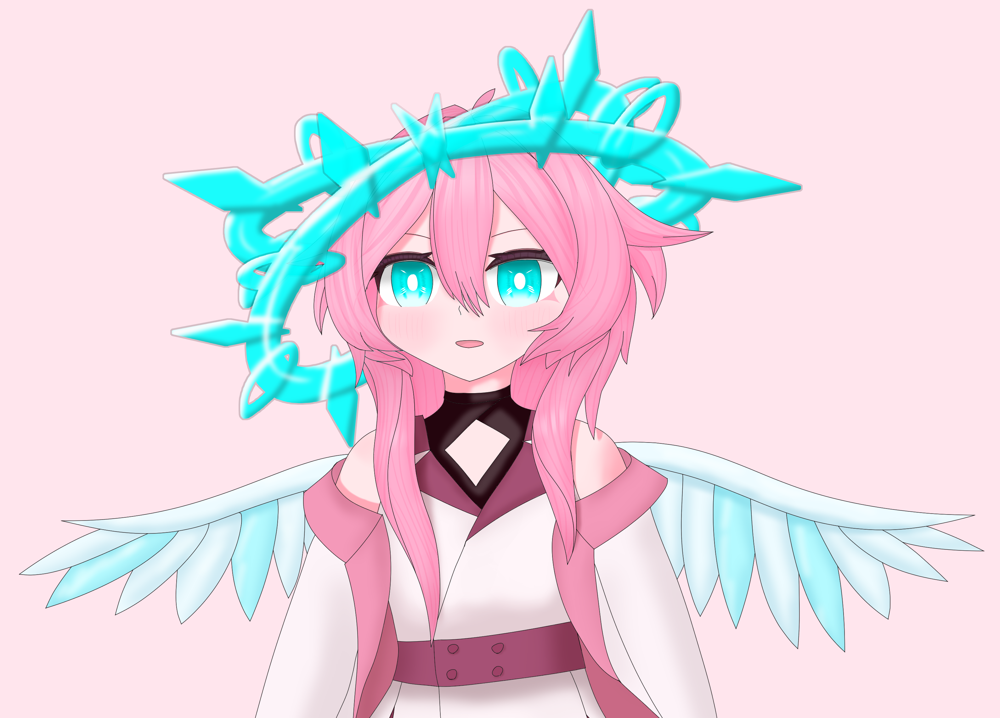

# オリジンの姿

別名: オリジンフォルム

[Reina_Sakiria](Reina_Sakiria.md)の姿と呼ぶに一番ふさわしい姿。

これら [オリジンの姿] はマナで形作られており、Reina_Sakiria の姿としての状態でしか存在できない制約を付与している。

[オリジンの姿]は[マナ]を使用し頑張れば無限に姿を改変することが可能で、それによって普段は翼が生えている。これは何を意味するかと言うと、獣耳や獣の尻尾を生やしたり、追加の腕を生やしたり、触手や触覚のようなものを生やしたりも可能で、かなり自由度高く体は拡張ができる。

[オリジンの姿] はマナで形作られている都合、切りつけたりでもして、部位欠損や怪我をしたとしても[マナ]がある限り無限に修復が可能。血もあるようで体の中にあるうちは赤色だが、流出したときに液状の[マナ]にもどり青くなる。

## 名前

今は、[オリジンの姿]とよんでいるが、過去 `Avatar N8 Reina` と呼ばれていた。

けれど、名前を奪い `Reina` が自身の名称となってしまったため、それを避けるために [オリジンの姿] と呼ぶようになった。

また、 [N8] と呼ぶこともあるが、それは一番最初の[オリジンの姿]を指すときに使用される。

[オリジンの姿]は Reina_Sakiria の在りたい姿を指す、なので時間が立つにつれて変わることがある。[オリジンの姿] はその総称であり全ての姿に対して使用可能である。

## N8

最初の [オリジンの姿]。

`Avatar N8 Reina` とも呼ばれていた。

手首や足首から霧状と結晶状態のマナが放出されていたり、二重のヘイローのように見える[マナのバッファ](マナ.md)、大きな四枚の羽が特徴。

身長は 145cm ほど、体重は不明だが軽いらしい。

赤き瞳、白い瞳孔、とてもキラキラしている瞳をしている。

赤色の強い アイシャドウ が入っている。

肩似つかないくらいのショートな髪型。

この翼は空を飛ぶための器官としての役割も持つようだが、その大きさはかなりな倍率で拡縮が可能。多分マナが詰まっている。普段は邪魔にならないようにするために手のひらぐらいの大きさ(つまり最小サイズ)なことが多い。

マナが通っているしろいガウン(上着?)を羽織っていて、その下はショートパンツと白いレオタード、靴はサンダルで素足が見える。
ガウンを羽織らないと結構際どい衣装となっているが、このガウンは[マナのバッファ]としての側面を持っているため基本的にずっと羽織っている。
際どくなる原因でもあるその白いレオタードはあるていどハイレグな形なっている。

ガウンにもハネのような `もふもふ` があるが、これは素材が羽である可能性はあるが羽ではない。

体型としては、[他者の姿]と比べるとあまりスタイルが良くない、[他者の姿]と比べると胴体がある程度長く足が短い。
あくまで [他者の姿] の多くが異常にスタイルが良いため、比べた時悪く見えるだけで、ある程度足が長い。逆に言うと腕は少し短いかもしれない。
また、胸のサイズはある程度大きいようだが計測されたことはなく、サイズは謎。だが見える限りは結構大きい。

3D モデルとして表現された姿はこのようになっている。

最近はこの 姿が表に出ることはない。

## N12

現在、最新の [オリジンの姿]、個別で呼ぶなら `N12` という名称となる。

フルで言うなら `Avatar N12 Reina` となるのかもしれない。

基本的な要素は [N8] と共通するが、少し幼くなっているし、[N8] が身長　145cm ほどだが、 [N12] は身長が 120cm ほどになっている。

髪の毛は少し長くなっていて、もみあげは胸辺りまで、後ろ髪は肩甲骨あたりまで伸びている。
もみあげは(本人の視点からみて)右側のほうが少し長い。

[マナのバッファ] であるヘイローは以前よりも巨大化しバッファとしても大きくなったようだ。
深く頭に被るようになったのは [疑天使の操り用具](疑天使の操り用具.md) からの影響が大きい。

この [マナのバッファ](ヘイロー) は2つに切り離すことも可能で切り離て投げつけたりすることもあるかもしれない。

[N8] と同様、四枚のマナの翼をもつが、以前よりも下側二枚の翼が大きくなり下向きになっている。
その羽はマナの供給のために使用されることが可能になったようで、供給のために使用してるか否かで色味が変わる。

衣装は [N8] のときと比べると一般的なものに近づいている。[マナのバッファ]としての役割は ヘイロー だけで良くなったのか、衣装に[マナのバッファ]としての機能は失われている。

白を基調にピンクの襟のデザインなアウター、襟の部分が少し濃い目ないろになっているインナー、[N8]と同様レオタードのような下着(胸辺りに少しスリットがある)も着ているが、以前は白だったが黒色に変わっている(ちなみにハイレグなのもそのまま)、また太ももくらいまでの長さの黒いニーソックスを履いている。(また、黒いのガーターも履いているらしい ... ? (表現されていないため謎))

また、黒いグローブフィンガーレスグローブを着るようにもなっている。

体型は、[N8]と概ね同じであるが、胸がナーフされている。未だ表現されていないため謎だが腰や足回りの肉付きは少し強化されているらしい ... ?

イラストとして表現した時にはこのようになる。(イラストであるため表現に揺れがあるようだ)

3D モデル としてはまだ存在しない。いつか、形作られるときが来るかもしれない。

### ぷにぷにした姿

更に幼く、ロリによった姿かもしれない [N12] の派生形。

身長は約 40cm ほど、非常に小さい。もはや羽のほうが大きいかもしれない。

ハネたり回ったりしていることが多い。何故か伸縮性があり、伸ばされたり潰されたりすることもしばしば ...

[オリジンの姿]: #オリジンの姿
[N8]: #n8
[N12]: #n12
[マナのバッファ]: マナ.md
[マナ]: マナ.md
[他者の姿]: 他者の姿.md
