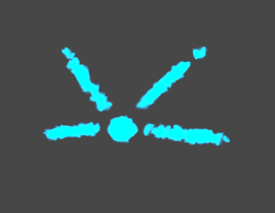

# フェアリーの姿

通称: フェアリーフォルム

それは魂のような思念体にも近いのかもしれない。

霧状の[マナ]だけでその姿は構築されていて、[オリジンの姿]に恣意的になっていない時や[オリジンの姿]を維持できない時、[他者の姿]に対する操りを外した時などに現れる、一時的な姿。

霧状のその姿は、物理法則に縛られず、壁をすり抜けたり、飛んでいったりすることができるのかもしれない。ただ、当人はこの姿で居ることをあまり好んではおらず、何らかの姿でいようとする。

また、[他者の姿]に入り込み操ることで姿が変化するのに対し、[オリジンの姿]に戻るときは[マナ]を纏うようにして姿を変化させる。

[オリジンの姿]: オリジンの姿.md
[マナ]: マナ.md
[他者の姿]: 他者の姿.md
