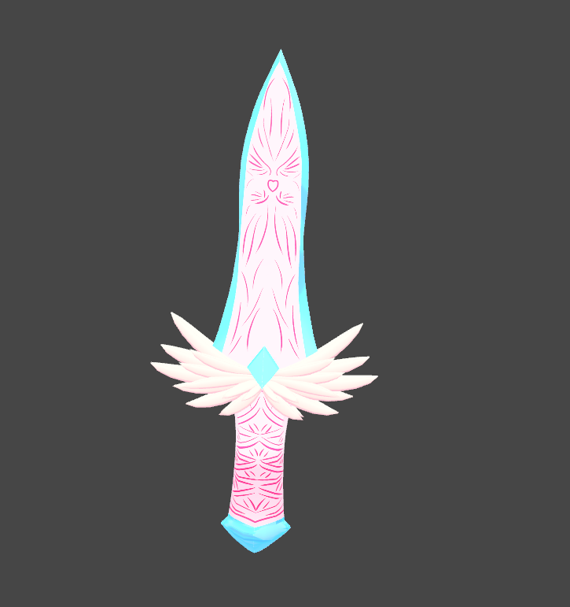

# マナ

それは、 [Botania](https://botaniamod.net/index.html) という Minecraft Mod に登場する Mana にかなり近い。

[Reina_Sakiria] にとって、血や酸素のようなレベルのものかもしれない。[Reina_Sakiria] はこれを[無限に生み出す](Reina_Sakiria.md#マナの生成)ことができる。

## 見た目

見た目は、 #00FFFF なシアン色をしていることが多いが、少し青に寄った色をすることもある。

状態は、液状な状態から、霧状や結晶状態な状態、クリスタルのような状態にもなることがあるが、これは [Reina_Sakiria] の [マナの任意操作] によって結構いろいろな状態にもなる。

## 味

状態にもよるし、[マナの任意操作] によっても味は変わるが、基本的には 甘味 がする。

だが、 [Reina_Sakiria] はその 甘味 が認識できず、わからない。なので [Reina_Sakiria] 自身がお腹を満たすときは、姿に応じた何らかの食べ物に[マナの任意操作]によって形を変える。

## 性質

特に霧状や結晶状態では、空気中に触れるとかなり早く完全に消失する。

液状は水と同程度の速度で消失するが、クリスタルのようなレベルになるとほぼ消失しなくなる。

## 使用

マナは、消失しやすいため [疑天使の操り用具] のような、マナのタンク や バッファ のような存在を経由することで多量のマナを [任意操作] することがやりやすくなる。

生成されたマナは、その直後は液状であることが多く、頑張れば、マナを直接 [任意操作] することもできるが ... ちょっとめんどくさく、あまりやらない。

[Reina_Sakiria] がその [マナの任意操作] をやりやすくするために、[マナの任意操作] を使い、[マナ]を扱う器具を作ることは多い。

### マナを使用した武器

[Reina_Sakiria] が作った、[マナ] により駆動する武器のこと。

#### ナイフ

いわゆる短剣、剣なので鋭そうに見えるかもしれないけれどその切れ味は悪い。

その性質は魔法の杖に近く、マナを取り扱う媒体がナイフの形をしているというふうに考えるほうが正確である。

けれど、ナイフの形をしているので、マナで刃を纏い強化すればかなりの切れ味を出すことが可能である。
が、それが使われたことはなく、過去にナイフにマナをまとわせることはあれど、それは基本的に衝撃波のような いわゆる ソードビーム を発生させることにしか使われてない。

#### マナの弓

矢を飛ばすことはできない。撃てるのは マナの弾だけ。

ある種の魔力球を打ち出すようなかたちで、その弾は跳弾する性質や爆発を起こすことも可能。

その弾の性質は引き絞り時間によって制御されているようだが、チャージしないと行けないわけではなく、強力な爆発を起こせる弾も、頑張れば連射できるかもしれないし、複数同時に撃つこともできるかもしれない。

[Reina_Sakiria]: Reina_Sakiria.md
[マナの任意操作]: Reina_Sakiria.md#マナの任意操作
[任意操作]: Reina_Sakiria.md#マナの任意操作
[疑天使の操り用具]: 疑天使の操り用具.md
[マナ]: #マナ
