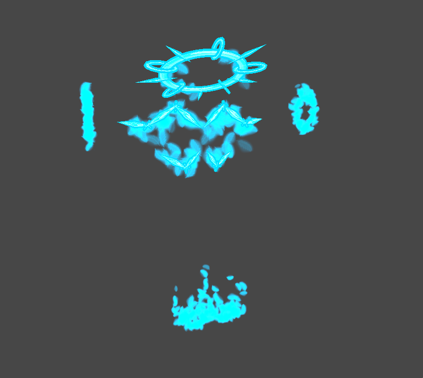

# 疑天使の操り用具

別名: P-Angel's Stealer

[Reina_Sakiria]が[オリジンの姿]ではない姿で在るため、[他者の姿]を扱うためによく利用されている器具。

ちなみに、この[疑天使の操り用具]が見えなくても [他者の姿] を操ることができる場合があるが、あったほうが扱いやすく、なしで [他者の姿] を操ることはあまりしない。

基本的のこの[疑天使の操り用具]は、[マナ]によって形作られていて、ヘイローやハネの部分は外側がクリスタル状態、内側が液状、ほか(手首手足やヘイローやハネから)流出している[マナ]は結晶や霧状になっている。

[マナ]のバッファとしての側面も、[オリジンの姿]のヘイローと同じで、[マナ]を過剰に使ったりすると、これら[疑天使の操り用具]は欠けたり壊れたり、液状のマナが流出したりする。(だが現実的に[基礎能力によって](Reina_Sakiria.md#２つの基礎能力)そういったことが起きたことはない。)

なお、そのクリスタル状態のマナの強度は任意に強化可能だが、[疑天使の操り用具]の状態はあまり強い強度ではない場合がある。頑張れば破壊できるかもしれない。
ときに、そのバッファのマナを一気に引き出すために、[ナイフ](マナ.md#ナイフ)を使用し自ら破壊することもある。

多くの人々がみたことがある [Reina_Sakiria] は [疑天使の操り用具] によって操られている [他者の姿] である。

## [他者の姿]を操る時

[操り用具の装着位置](#操り用具の装着位置) を参考に、その四対の羽を背中に、ヘイローは髪の毛などが干渉しない程度に可能な限り深く被る。

それと同時に、髪の毛の色をピンク色に染め、角や尻尾や獣の耳といったその姿の肉体の一部となっている部位の範囲にはピンク色が及ぶことがある。また、流し込まれた(後述) [マナ] によって、瞳が青く光るようにもなる。

操ろうとするその姿に [マナ] を流し込みすべての神経や筋肉を制御しているのかもしれない。寄生といっても否定できないようなことが行われている。

なお、操りが外れた時、流し込まれた [マナ] は(謎の力で)すべて、すぐに消失し元通りになる。

[オリジンの姿] と同様[マナ]を用いて姿を改変することもできるが、その[マナ]の消費量は [オリジンの姿] を変化させるときよりも大きく、あまり行われない。また、[他者の姿]によっては改変ができなかったり、行おうとした改変が失敗することすらもある。

## 半操り状態

たまに、操りが半分外れた状態や微妙に外れた状態を発生させることがある。

頻繁に姿を乗り移る状況下で、[マナ]を流し込んだまま操りを外した場合はこのような状態が発生する。

逆に、すぐにまた操りを再開できるレベルで、 95% ぐらい操りが外れた状態で姿を放置することがあり、外れた瞬間はこのようになる。

ちなみに、[オリジンの姿] では基本的にこのような状態が発生しない。[他者の姿]を操ろうとした時、[オリジンの姿]の姿は 液状の[マナ]となり溶ける。
こういった状態は [他者の姿] でしか基本的に発生しない。

## 疑天使?

[疑天使の操り用具] の 疑天使 というの名前は、[オリジンの姿] の姿が、天使に似ているから発生している。

けれど [Reina_Sakiria] は天使ではない。性質的に言えば [マナ]の精霊 といったほうが正しいくらいである。

つまり、まがい物や擬似的、そんな天使のような見た目をしているかもしれないが天使ではない存在が、[他者の姿] を操るための道具なので [疑天使の操り用具]。

## 操り用具の装着位置

### ヘイロー

輪に頭をできるだけ重なるように深く通す。

顔に干渉しないよう、後頭部と顔の間の額に前側が来るようにしながら、後側を後頭部や項周辺になるようにする。

その際、 正面から見た時、傾けない or 左右どちらかに傾けるかは自由、また、その姿が持つ角や耳、衣装や髪型などに合わせて適宜調整。

### 翼

Mainとなる上側の翼は、肩甲骨あたりの高さ、肋骨の中間より高く肩よりは低い。

Tailとなる下側の翼はウエストからおしりの付け根(よく尻尾が生えている高さ)の間。

その姿が着ている衣装と干渉しないように適宜調整し配置する必要がある。

[Reina_Sakiria]: Reina_Sakiria.md
[疑天使の操り用具]: #疑天使の操り用具
[マナ]: マナ.md
[他者の姿]: 他者の姿.md
[オリジンの姿]: オリジンの姿.md
